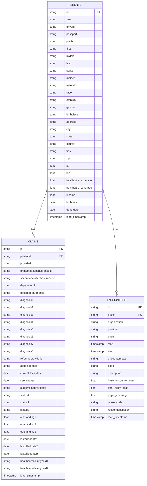
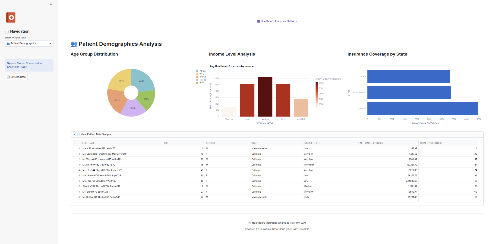

# 🏥 360° Healthcare Insurance Analytics Platform

A comprehensive Healthcare Insurance Analytics Platform built on Snowflake data cloud, providing deep insights into healthcare insurance data through interactive dashboards and advanced analytics.

## 📋 Project Overview

This project is a sophisticated healthcare insurance analytics system designed to help users better understand and manage their healthcare insurance needs. Built on the Snowflake platform, it processes healthcare insurance data generated by Synthea, providing comprehensive data collection, cleaning, analysis, and visualization capabilities.

### 🎯 Target Audience

This platform is specifically designed for the following user groups:

- **Healthcare Insurance Companies**: Insurance providers looking to analyze claims patterns, patient demographics, and financial trends to improve underwriting and risk assessment
- **Healthcare Providers**: Hospitals and clinics seeking insights into patient encounters, provider performance, and revenue optimization
- **Healthcare Administrators**: Management teams requiring executive dashboards and KPIs for strategic decision-making
- **Data Analysts**: Healthcare data professionals needing comprehensive tools for data exploration and analysis
- **Researchers**: Academics and researchers studying healthcare trends, patient demographics, and insurance patterns
- **Regulatory Compliance Teams**: Teams monitoring healthcare data compliance and reporting requirements

### 🚀 Key Benefits

- **Comprehensive Data Analysis**: Process and analyze large-scale healthcare insurance data with advanced SQL and Python capabilities
- **Real-time Insights**: Access up-to-date analytics with automated data loading through Snowpipe
- **Interactive Visualization**: User-friendly dashboards with filtering, sorting, and export capabilities
- **Scalable Architecture**: Built on Snowflake's cloud-native platform for unlimited scalability
- **Cost-effective**: Optimized data processing and storage to minimize operational costs
- **Regulatory Compliance**: Structured data architecture supporting healthcare compliance requirements

### Key Features

- **Data Collection & Storage**: Collect healthcare insurance data from Synthea simulation tool and store securely in S3 buckets
- **Data Processing & Cleaning**: Automated data loading through Snowpipe with comprehensive data cleaning and preprocessing
- **Advanced Analytics**: Leverage Snowflake's powerful computing capabilities for deep data analysis and predictive modeling
- **Interactive Dashboards**: Native Streamlit integration for creating interactive dashboards and reports
- **Real-time Insights**: Real-time data updates and comprehensive reporting capabilities

## 🛠️ Technology Stack

| Component | Technology | Purpose |
|-----------|------------|---------|
| **Data Storage** | Amazon S3 | Raw healthcare insurance data storage |
| **Data Warehouse** | Snowflake | Primary data warehouse platform for large-scale data processing |
| **Data Loading** | Snowpipe | Automated data loading and real-time updates |
| **Data Analysis** | Snowflake SQL, Python | Data analysis and modeling |
| **Data Visualization** | Streamlit, Plotly | Interactive data visualization interface |
| **Application** | Streamlit | Web-based analytics platform |
| **Data Generation** | Synthea | Synthetic healthcare data generation for testing and development |

### 📚 Detailed Technology Description

- **Amazon S3**: Secure, scalable object storage for raw healthcare insurance data files
- **Snowflake**: Cloud-based data warehouse providing unlimited storage and compute power
- **Snowpipe**: Continuous data ingestion pipeline for real-time data loading
- **Streamlit**: Open-source Python library for creating web applications for machine learning and data science
- **Plotly**: Interactive graphing library for creating beautiful, publication-quality visualizations
- **Synthea**: Open-source patient population generator that creates realistic, synthetic patient data

## 🏗️ Architecture Overview

The platform follows a 4-layer data modeling architecture:

### 1. Raw Layer
- Stores original healthcare insurance data from S3 buckets
- Maintains data integrity and original state
- Tables: `patients`, `claims`, `encounters`

### 2. Processed Layer
- Cleans and transforms raw data into structured tables
- Generates dimension and fact tables for analysis
- Tables: `dim_patients`, `fact_claims`, `fact_encounters`

### 3. Analytics Layer
- Builds analytical models and views based on processed data
- Supports various data analysis requirements
- Views: 6 specialized analytical views

### 4. Presentation Layer
- Interactive dashboards and reports via Streamlit
- User-friendly data visualization and reporting
- Dashboards: 6 main dashboard views

## 📊 Entity Relationship Diagram (ERD)

### 📊 Raw Layer Entity Relationship Diagram (ERD)



### 📊 Processed Layer Entity Relationship Diagram (ERD)



```mermaid
erDiagram
    DIM_PATIENTS ||--o{ FACT_CLAIMS : "has"
    DIM_PATIENTS ||--o{ FACT_ENCOUNTERS : "has"
    
    DIM_PATIENTS {
        string id PK
        string ssn
        string drivers
        string passport
        string full_name
        string prefix
        string first
        string middle
        string last
        string suffix
        string maiden
        string marital
        string marital_status
        string race
        string ethnicity
        string gender
        string gender_full
        string birthplace
        string address
        string city
        string state
        string county
        string fips
        string zip
        float lat
        float lon
        float healthcare_expenses
        float healthcare_coverage
        float income
        int age
        string age_group
        string income_level
        string coverage_tier
        boolean is_alive
        date birthdate
        date deathdate
        timestamp processed_timestamp
    }
    
    FACT_CLAIMS {
        string claim_id PK
        string patient_id FK
        string provider_id
        string primary_insurance_id
        string secondary_insurance_id
        string department_id
        string patient_department_id
        string diagnosis1
        string diagnosis2
        string diagnosis3
        string diagnosis4
        string diagnosis5
        string diagnosis6
        string diagnosis7
        string diagnosis8
        int diagnosis_count
        string referring_provider_id
        string appointment_id
        date current_illness_date
        date service_date
        string supervising_provider_id
        string primary_status
        string secondary_status
        string patient_status
        float primary_outstanding
        float secondary_outstanding
        float patient_outstanding
        float total_outstanding
        date primary_last_billed_date
        date secondary_last_billed_date
        date patient_last_billed_date
        string primary_claim_type
        string secondary_claim_type
        string insurance_coverage_type
        string outstanding_risk_level
        int service_year
        int service_month
        int service_quarter
        timestamp processed_timestamp
    }
    
    FACT_ENCOUNTERS {
        string id PK
        string patient_id FK
        string organization_id
        string provider_id
        string payer_id
        timestamp encounter_start
        timestamp encounter_stop
        string encounter_class
        string encounter_code
        string encounter_description
        float base_encounter_cost
        float total_claim_cost
        float payer_coverage
        string reason_code
        string reason_description
        int duration_minutes
        float duration_hours
        float patient_out_of_pocket
        float payer_coverage_percentage
        date encounter_date
        int encounter_year
        int encounter_month
        int encounter_day_of_week
        string encounter_day_name
        int encounter_quarter
        string cost_category
        timestamp processed_timestamp
    }
```

## 🗄️ Database Schema

### Raw Layer Tables

#### Patients Table
```sql
CREATE OR REPLACE TABLE patients (
  id VARCHAR(100),
  birthdate DATE,
  deathdate DATE,
  ssn VARCHAR(20),
  drivers VARCHAR(20),
  passport VARCHAR(20),
  prefix VARCHAR(10),
  first VARCHAR(50),
  middle VARCHAR(50),             
  last VARCHAR(50),
  suffix VARCHAR(10),
  maiden VARCHAR(50),
  marital VARCHAR(1),
  race VARCHAR(50),
  ethnicity VARCHAR(50),
  gender VARCHAR(1),
  birthplace VARCHAR(200),
  address VARCHAR(200),
  city VARCHAR(50),
  state VARCHAR(50),
  county VARCHAR(50),
  fips VARCHAR(20),                
  zip VARCHAR(10),
  lat FLOAT,
  lon FLOAT,
  healthcare_expenses FLOAT,
  healthcare_coverage FLOAT,
  income FLOAT,                    
  load_timestamp TIMESTAMP_NTZ DEFAULT CURRENT_TIMESTAMP()
);
```

#### Claims Table
```sql
CREATE OR REPLACE TABLE claims (
  id VARCHAR(100),
  patientid VARCHAR(100),
  providerid VARCHAR(100),
  primarypatientinsuranceid VARCHAR(100),
  secondarypatientinsuranceid VARCHAR(100),
  departmentid VARCHAR(100),
  patientdepartmentid VARCHAR(100),
  diagnosis1 VARCHAR(50),
  diagnosis2 VARCHAR(50),
  diagnosis3 VARCHAR(50),
  diagnosis4 VARCHAR(50),
  diagnosis5 VARCHAR(50),
  diagnosis6 VARCHAR(50),
  diagnosis7 VARCHAR(50),
  diagnosis8 VARCHAR(50),
  referringproviderid VARCHAR(100),
  appointmentid VARCHAR(100),
  currentillnessdate DATE,
  servicedate DATE,
  supervisingproviderid VARCHAR(100),
  status1 VARCHAR(10),
  status2 VARCHAR(10),
  statusp VARCHAR(10),
  outstanding1 FLOAT,
  outstanding2 FLOAT,
  outstandingp FLOAT,
  lastbilleddate1 DATE,
  lastbilleddate2 DATE,
  lastbilleddatep DATE,
  healthcareclaimtypeid1 VARCHAR(1),
  healthcareclaimtypeid2 VARCHAR(1),
  load_timestamp TIMESTAMP_NTZ DEFAULT CURRENT_TIMESTAMP()
);
```

#### Encounters Table
```sql
CREATE OR REPLACE TABLE encounters (
  id VARCHAR(100),
  "start" TIMESTAMP,
  "stop" TIMESTAMP,
  patient VARCHAR(100),
  organization VARCHAR(100),
  provider VARCHAR(100),
  payer VARCHAR(100),
  encounterclass VARCHAR(50),
  code VARCHAR(50),
  description VARCHAR(500),
  base_encounter_cost FLOAT,
  total_claim_cost FLOAT,
  payer_coverage FLOAT,
  reasoncode VARCHAR(50),
  reasondescription VARCHAR(500),
  load_timestamp TIMESTAMP_NTZ DEFAULT CURRENT_TIMESTAMP()
);
```

### Processed Layer Tables

#### Patients Dimension Table
```sql
CREATE OR REPLACE TABLE PROCESSED_DATA.dim_patients (
    id STRING,
    birthdate DATE,
    deathdate DATE,
    ssn STRING,
    drivers STRING,
    passport STRING,
    full_name STRING,
    prefix STRING,
    first STRING,
    middle STRING,
    last STRING,
    suffix STRING,
    maiden STRING,
    marital STRING,
    marital_status STRING,
    race STRING,
    ethnicity STRING,
    gender STRING,
    gender_full STRING,
    birthplace STRING,
    address STRING,
    city STRING,
    state STRING,
    county STRING,
    fips STRING,
    zip STRING,
    lat FLOAT,
    lon FLOAT,
    healthcare_expenses FLOAT,
    healthcare_coverage FLOAT,
    income FLOAT,
    age INTEGER,
    age_group STRING,
    income_level STRING,
    coverage_tier STRING,
    is_alive BOOLEAN,
    processed_timestamp TIMESTAMP
);
```

#### Claims Fact Table
```sql
CREATE OR REPLACE TABLE processed_data.fact_claims (
    claim_id STRING,
    patient_id STRING,
    provider_id STRING,
    primary_insurance_id STRING,
    secondary_insurance_id STRING,
    department_id STRING,
    patient_department_id STRING,

    diagnosis1 STRING,
    diagnosis2 STRING,
    diagnosis3 STRING,
    diagnosis4 STRING,
    diagnosis5 STRING,
    diagnosis6 STRING,
    diagnosis7 STRING,
    diagnosis8 STRING,

    diagnosis_count INTEGER,

    referring_provider_id STRING,
    appointment_id STRING,
    current_illness_date DATE,
    service_date DATE,
    supervising_provider_id STRING,

    primary_status STRING,
    secondary_status STRING,
    patient_status STRING,

    primary_outstanding FLOAT,
    secondary_outstanding FLOAT,
    patient_outstanding FLOAT,
    total_outstanding FLOAT,

    primary_last_billed_date DATE,
    secondary_last_billed_date DATE,
    patient_last_billed_date DATE,

    primary_claim_type STRING,
    secondary_claim_type STRING,

    insurance_coverage_type STRING,
    outstanding_risk_level STRING,

    service_year INTEGER,
    service_month INTEGER,
    service_quarter INTEGER,

    processed_timestamp TIMESTAMP
);
```

#### Encounters Fact Table
```sql
CREATE OR REPLACE TABLE processed_data.fact_encounters (
    id STRING,

    encounter_start TIMESTAMP,
    encounter_stop TIMESTAMP,

    patient_id STRING,
    organization_id STRING,
    provider_id STRING,
    payer_id STRING,

    encounter_class STRING,
    encounter_code STRING,
    encounter_description STRING,

    base_encounter_cost FLOAT,
    total_claim_cost FLOAT,
    payer_coverage FLOAT,

    reason_code STRING,
    reason_description STRING,

    duration_minutes INTEGER,
    duration_hours FLOAT,
    patient_out_of_pocket FLOAT,
    payer_coverage_percentage FLOAT,

    encounter_date DATE,
    encounter_year INTEGER,
    encounter_month INTEGER,
    encounter_day_of_week INTEGER,
    encounter_day_name STRING,
    encounter_quarter INTEGER,

    cost_category STRING,
    processed_timestamp TIMESTAMP
);
```

### Analytics Layer Views

The platform includes 6 specialized analytical views:

[Dashboard](https://app.snowflake.com/us-east-1/onc82231/#/streamlit-apps/HEALTHCARE_INSURANCE_DB.ANALYTICS.FZAB9UEMVFDWK_XW)

1. **EXECUTIVE DASHBOARD VIEW** - High-level business metrics and KPIs
2. **PATIENT DEMOGRAPHICS VIEW** - Patient population analysis and demographics
3. **ENCOUNTER ANALYSIS VIEW** - Encounter patterns and provider performance
4. **CLAIMS MANAGEMENT VIEW** - Claims processing and diagnosis trends
5. **FINANCIAL INSIGHTS VIEW** - Revenue and financial analysis
6. **GEOGRAPHIC ANALYSIS VIEW** - Geographic distribution and regional analysis

## 📈 Dashboard Features

### 1. Executive Dashboard

- Key Performance Indicators (KPIs)
- Revenue trends and analysis
- Encounter volume tracking
- Cost category distribution

### 2. Patient Demographics Analysis

- Age group distribution
- Income level analysis
- Insurance coverage by state
- Patient data samples

### 3. Encounter & Provider Performance

- Provider performance metrics
- Encounter volume trends
- Coverage analysis by payer
- Provider revenue analysis

### 4. Claims Management & Diagnosis Trends

- Claims status overview
- Risk level analysis
- Diagnosis complexity analysis
- Outstanding amount tracking

### 5. Financial Insights

- Revenue vs patient burden trends
- Financial burden categories

### 6. Geographic Analysis

- State-level performance metrics
- Geographic risk analysis
- City-level outstanding debt tracking
- Regional cost distribution

## 📖 Usage Guide

### Navigation

The platform features a sidebar navigation with the following options:

1. **🎯 Executive Dashboard** - High-level business metrics
2. **👥 Patient Demographics** - Patient population analysis
3. **🏥 Encounter & Provider Analysis** - Healthcare service metrics
4. **📋 Claims & Diagnosis** - Claims processing analysis
5. **💰 Financial Insights** - Revenue and financial analysis
6. **🗺️ Geographic Analysis** - Regional distribution analysis

### Data Refresh

- Click the "🔄 Refresh Data" button in the sidebar to reload cached data
- Data is cached for 10 minutes (600 seconds) for performance optimization
- Manual refresh clears all cached data and reloads fresh data

### Interactive Features

- **Filters**: Use dropdown menus and date pickers to filter data
- **Charts**: Interactive Plotly charts with hover details
- **Tables**: Sortable data tables with expandable rows
- **Export**: Download data as CSV or Excel files
